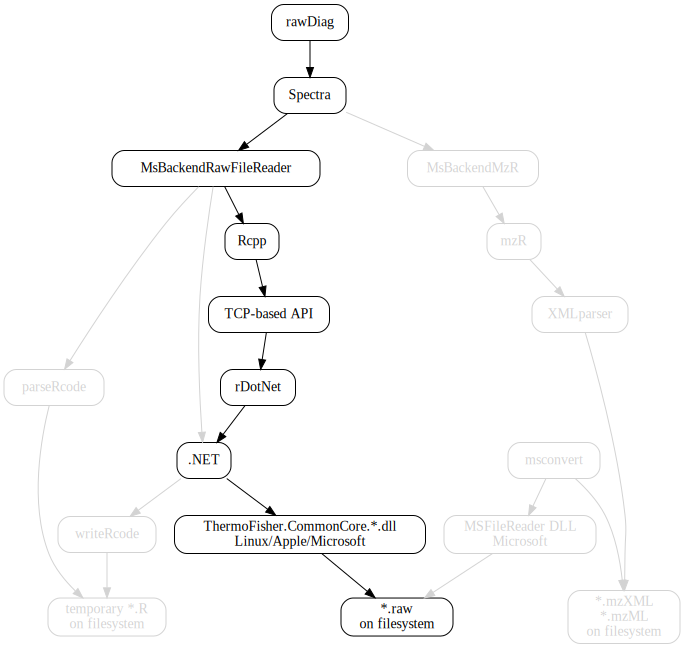

<style>
.forceBreak { -webkit-column-break-after: always; break-after: column; }
</style>

```{r setup, include=FALSE}
knitr::opts_chunk$set(echo = TRUE,  eval=TRUE, message=FALSE, warning=FALSE)
```

## The Functional Genomics Center Zurich

- joint state-of-the-art research and training (core) facility of ETH Zurich and University of Zurich.

- offer/support analytical services, training, collaborative R&D in:

`Genomics |  Metabolomics | Proteomics`

Proteomics currently processes output of ~12 MS (mostly LC-ESI-MS). Many Orbitraps, fewer TOFs. 

https://fgcz.ch/ 


## Past and present

`rawDiag | rawrr | MsBackendRawFileReader`

<div class="columns-2">

interfacing ThermoFisher libraries via:

1. `system2` call
	+ `mono rawrr.exe` 
	+ parse R code via `source`
2. `rCLr` see https://github.com/rdotnet/rClr/blob/master/R/zzz.R

```{r arch2, echo=FALSE, out.width="90%", error=TRUE, fig.align='center'}

```
</div>


## Future - invoke managed methods from C {.smaller}


<div class="columns-2">

How embedding works:

<table>

<tr style="border:2px solid black">
<td style="padding:15px">
`R>`
</td>
</tr>

<tr style="border:2px solid black">
<td style="padding:15px">
`Rcpp module`
</td>
</tr>

<tr style="background-color:yellow;color:black; border:2px solid black">
<td style="padding:15px">
`C++ code`
</td>
</tr>

<tr style="background-color:yellowgreen;color:black; border:2px solid black">
<td style="padding:15px">
Mono Runtime - linking `libmono-2`
</td>
</tr>

<tr style="background-color:orange;color:black; border:2px solid black">
<td style="padding:15px">
Managed Assembly
(CIL/.NET code)
</td>
</tr>

<tr style="background-color:orange;color:black; border:2px solid black">
<td style="padding:15px">
ThermoFisher.CommonCore.*.dll
</td>
</tr>

</table>


```{r eval=FALSE}
# Rcpp::sourceCpp("rawrrRcpp.cpp")
# INPUT:
rawfile <- "sample.raw"
scan <- 1

R <- new(Rawrr)
R.setAssembly(rawrr:::.rawrrAssembly())
R.setFileName(rawfile)

# OUTPUT: 
mZ <- R.getValues(scan, 'mZ')
intensities <- R.getValues(scan, 'intensities')
nois <- R.getValues(scan, 'noise')
resolution <- R.getValues(scan, 'resolution')
trailer <- R.getTrailer(scan)

R$deconstructor()
```

</div>

```
$ mono --version
Mono JIT compiler version 5.18.0.240 (Debian 5.18.0.240+dfsg-3 Wed Apr 17 16:37:36 UTC 2019)
```

https://www.mono-project.com/docs/advanced/embedding/

## Conclusion - next steps {.build}

<div class="columns-2">
* tested on MacOSX | Linux mono version 5.18

```{r benchmark, fig.width=4, fig.height=4, fig.retina=3, echo=FALSE}
lattice::bwplot(Sepal.Length ~ Species | Species,
  data=iris)
```
pros:

* mono 5.17
* static linking => requires mono install on deploy system

cons:

* failed to build with mono version 6.x
* What is about with dot net?

thanks:

* Tobias Kockmann <tobias.kockmann@fgcz.ethz.ch>
* Christian Trachsel
* Witold E. Wolski
</div>

<div class='note'>
```{r prx, echo=FALSE, out.width="100%", error=TRUE, fig.align='center'}
knitr::include_graphics("/Users/cp/Desktop/20211026-prx-Ziegelhuette.jpg")
```
`staffproteomics@fgcz.ethz.ch`
</div>

## Session information {.smaller}

```{r sessioninfo, echo=FALSE}
sessionInfo()
```

