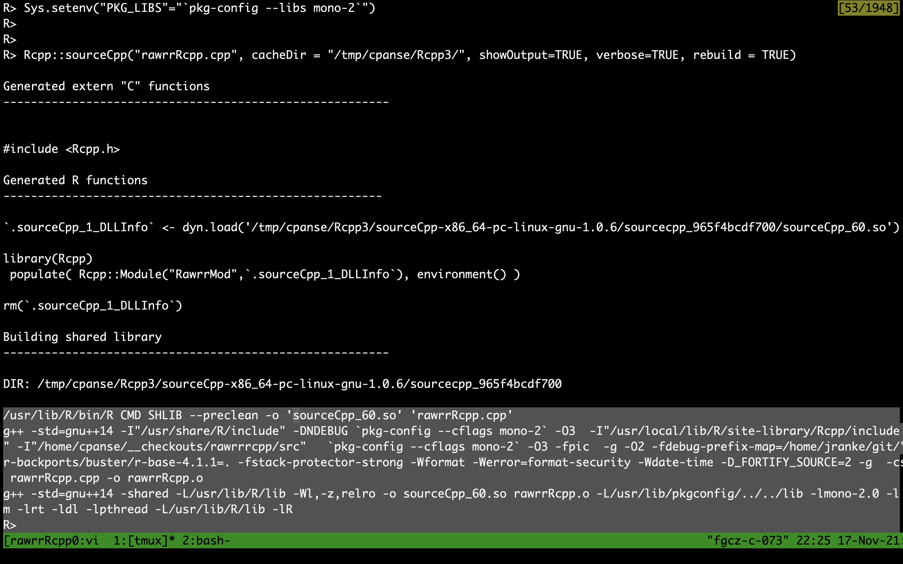

<style>
.forceBreak { -webkit-column-break-after: always; break-after: column; }
</style>

```{r setup, include=FALSE}
knitr::opts_chunk$set(echo = TRUE,  eval=TRUE, message=FALSE, warning=FALSE)
options(prompt = "R> ")
```

## Interfacing `ThermoFisher.CommonCore.*.dll`

R package `rawrr` provides direct acces to proprietary formated vendor data using .NET assemblies.

<div class="columns-2">

current (Bioc v3.14) `rawrr` implementation:

1. `system2` call `mono rawrr.exe argv > out.R` 
2. parse R code by calling `source('out.R')`

**problems**:

* overhead for `system2` call and parse using `source`
* requires: cross platform, open source .NET framework [mono](https://www.mono-project.com/)-runtime installed on macOS and Linux
* language setting issues [#33](https://github.com/fgcz/rawDiag/issues/33)

```{r rawrrlogo, echo=FALSE, out.width="65%", error=TRUE, fig.align='center'}
knitr::include_graphics("rawrr_logo.png")
```
</div>
first solution approach:

* using `rCLr` see https://github.com/rdotnet/rClr/blob/master/R/zzz.R :-( &#10006;

## Solution - invoke managed methods from C++

<table>
<tr style="border:2px solid black">
<td style="padding:15px">
`R>`
</td>
</tr>

<tr style="border:2px solid black">
<td style="padding:15px">
`Rcpp module`
</td>
</tr>

<tr style="background-color:yellow;color:black; border:2px solid black">
<td style="padding:15px">
`C++ code`
</td>
</tr>

<tr style="background-color:yellowgreen;color:black; border:2px solid black">
<td style="padding:15px">
Mono Runtime - linking `libmono-2`
</td>
</tr>

<tr style="background-color:orange;color:black; border:2px solid black">
<td style="padding:15px">
Managed Assembly
(CIL/.NET code)
<br>
rawrr.exe
</td>
</tr>

<tr style="background-color:orange;color:black; border:2px solid black">
<td style="padding:15px">
ThermoFisher.CommonCore.*.dll
</td>
</tr>
</table>

<br>

* https://docs.microsoft.com/en-us/dotnet/standard/managed-code
* https://www.mono-project.com/docs/advanced/embedding/
* https://planetorbitrap.com/rawfilereader (dead link)
* https://github.com/thermofisherlsms/ThermoRawFileParser/tree/master/packages/ThermoFisher.CommonCore.RawFileReader.4.0.26


## Code snippet - reproduce scan 9594 EH4547

```{r eval=TRUE, echo=TRUE, fig.width=9, fig.height=3}
Sys.setenv("PKG_CXXFLAGS"="`pkg-config --cflags mono-2` -O3")
Sys.setenv("PKG_LIBS"="`pkg-config --libs mono-2`")
setwd('../src/'); Rcpp::sourceCpp("rawrrRcpp.cpp")                     # compile and link
EH4547 <- "/home/cpanse/.cache/R/ExperimentHub/18e7d5bfb4a3b_4590.raw" # input
R <- new(Rawrr); R$setDomainName("rawrrRcpp"); R$createObject();       # C++ ctor; start runtime
R$setRawFile(EH4547); R$openFile()                                     # invoke managed methods
mZ <- R$get_values(9594, "CentroidScan.Masses"); intensity <- R$get_values(9594, "CentroidScan.Intensities")
plot(mZ, intensity , type='h')
```
https://bioconductor.org/packages/rawrr/ - [vignette Figure 1](https://bioconductor.org/packages/release/bioc/vignettes/rawrr/inst/doc/rawrr.html#31_Use_Case_I_-_Analyzing_Orbitrap_Spectra).

## Single core I/O performance using EH4547

```{r benchmark, fig.width=9, fig.height=5.5, fig.retina=3, echo=FALSE}
source('plotBenchmark.R')
```

## Conclusion, thoughts, and open issues

* invoke managed methods (ThermoFisher.CommonCore.*.dll) using Rcpp/C++ and libmono-2
  * technically sound
  * is faster than current `r BiocStyle::Biocpkg("rawrr")` implementation (3-8x for reading more than 20K spectra)
  * solves language setting/digits setup issues, e.g., https://github.com/fgcz/rawDiag/issues/33
* it runs for mono version 5.18.0.240 (Apr 17 16:37:36 UTC 2019).
  * It **fails** on the current mono versions (6.12.x.x) when using Rcpp.!?
* Can we use static linked libraries, e.g., libmono-2.a?
  * If yes, no mono install is required for Windows`|`macOS binary R packages.
* What about using dotnet?  ...

* Source code snippets: https://gitlab.bfabric.org/proteomics/rawrrrcpp

## Thanks

* Tobias Kockmann (FGCZ)
* Christian Trachsel (FGCZ alumni)
* Witold E. Wolski (FGCZ)
* Hervé Pagès  (Bioconductor)

```{r ZH, echo=FALSE, out.width="100%", error=TRUE, fig.align='center'}

```

<div class='note'>
```{r prx, echo=FALSE, out.width="100%", error=TRUE, fig.align='center'}
knitr::include_graphics("20211026-prx-Ziegelhuette.jpg")
```
`staffproteomics@fgcz.ethz.ch`
</div>


# Appendix

***
```{r sessioninfo, echo=FALSE}
sessionInfo()
```
***
```{bash}
mono --version
```

## {data-background=rawrrRcpp-make.jpg}
```{r make, echo=FALSE, out.width="100%", error=TRUE, fig.align='center', eval=FALSE}

```
